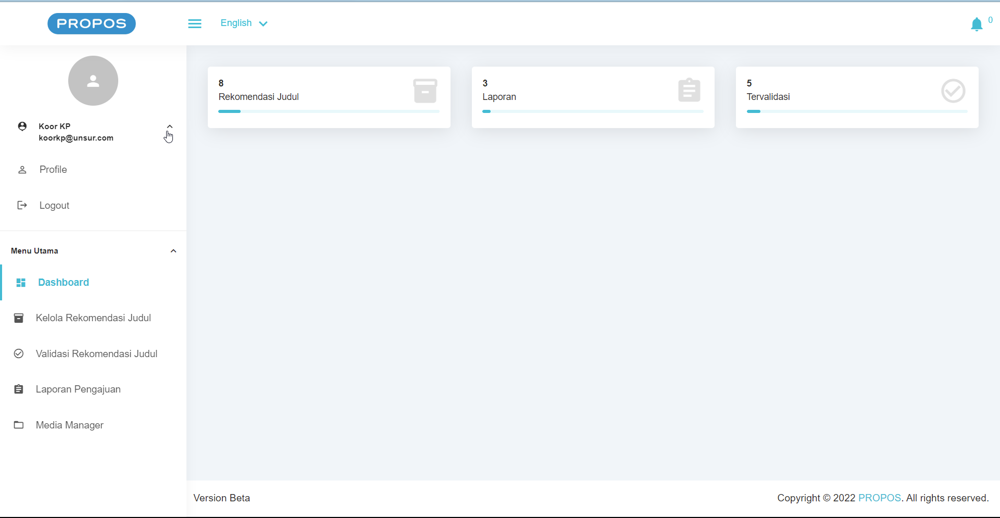

<h1 align="center">Sistem Pengajuan Proposal</h1>
<p> Helmi Sulaeman</p>
<p> Enjoy The Project </p>


## PREVIEW


<p>Login Page</p>

<p>Mahasiswa Dashboard</p>

<p>Koor KP Dashboard</p>

<p>Prodi Dashboard</p>


## Install

```sh
npm install
composer install
```
```sh

## Fix if php error  
composer self-update
composer clear-cache
rm -rf vendor
rm composer.lock
composer install --ignore-platform-reqs
```
## Usage

```sh
cp .env.example .env
php artisan key:generate
php artisan migrate:refresh --seed
php artisan storage:link
```

## Run tests

```sh
php artisan serve
```

## Account

```sh
Admin
Email    : koorkp@unsur.com
password : koorkp123456
```

```sh
User
Email    : prodi@unsur.com
password : prodi123456
```

```sh
Pegawai
Email    : mahasiswa@unsur.com
password : mahasiswa123456
```
